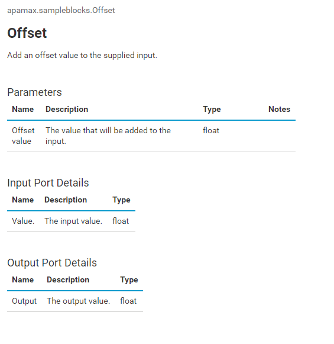

# Naming and documenting blocks

Within a block, some fields, action names and parameters within actions have special meanings and will be used by the framework, while blocks can include other fields and actions that the framework will not use. To identify which actions and fields have a special meaning, the dollar (`$`) character is used to identify actions and fields with a special meaning. Some parameters in special actions will also use the `$` prefix, such as `$input_`.

Similarly, as well as the standard ApamaDoc tags that start with an `@` character, Analytics Builder extended tags can be used in a number of places. These extended tags start with the characters `@$`.

Some aspects of blocks, namely parameters and block state, make use of separate event definitions. These use the block's name with a suffix which starts with `_$`.

The following example shows a block with a parameter:

```Java
package apamax.sampleblocks;
using apama.analyticsbuilder.BlockBase;
using apama.analyticsbuilder.Activation;

event Offset_$Parameters {
    float offset;
}

event Offset {
    BlockBase $base;
    Offset_$Parameters $parameters;
    action $process(Activation $activation, float $input_value) {
        $setOutput_output($activation, $parameters.offset + $input_value);
    }
    action<Activation, float> $setOutput_output;
}
```

Note the `$` prefix on `$base`, `$parameters` and `$setOutput_output` fields, and the `$process` action with parameters `$activation` and `$input_value`. Similarly, the type `Offset_$Parameters` starts with the block's type name, but ends in a `_$Parameters` suffix.

If a field of the block or a parameter of the `$process` method has a `$` prefix but is not recognized by the Analytics Builder framework, then that is an error and the model will fail to start. Thus, the `$` prefix is a namespace reserved for the Analytics Builder's use only. Other fields or actions will be ignored by the framework.

## Documenting names and descriptions

`value`, `output` and `offset` must be valid EPL identifiers. That is, they must consist of alphanumeric and/or underscore characters. These are identifiers used within the EPL implementation of the block. By supplying ApamaDoc comments, a more human readable name and a longer description can be assigned to each of these. The name is the first sentence - it should end with a period (`.`) and be separated by a blank line (other than the `*` character which is permitted within ApamaDoc comments). For the `offset` and `$setOutput_output` members, the ApamaDoc block should appear immediately before the field. For the `$input_value` parameter, the name is identified with an ApamaDoc tag `@$inputName <id> <name>`. The parameter's description is provided with the standard `@param $input_<id> <description>`. The ordering of the inputs and outputs will determine how they are presented in the model editor. By convention, if there is a more important or "primary" input or output, then place that first.

The block's name and description are also provided in ApamaDoc comments, before the event definition of the block. In the block's ApamaDoc comment, the supported extended tags include:

* `@$blockCategory <Category>` - identifies the category in the model editor's palette in which the block should appear.
* `@$derivedName` - provides a name which can include a parameter value by using `$<parameter name>`.
* `@$titleIsDerived` - if set and true, use the derived name in the block parameters dialog as well; typically only set for input/output blocks.

The above example block with documentation is thus:

```Java
package apamax.sampleblocks;
using apama.analyticsbuilder.BlockBase;
using apama.analyticsbuilder.Activation;

event Offset_$Parameters {
    /**
     * Offset value.
     *
     * The value that will be added to the input.
     */
    float offset;
}

/**
 * Offset.
 *
 * Add an offset value to the supplied input.
 * @$blockCategory Calculations
 * @$derivedName Offset $offset
 */
event Offset {
    BlockBase $base;
    Offset_$Parameters $parameters;
    /**
     * @param $input_value The input value.
     * @$inputName value Value.
     */
    action $process(Activation $activation, float $input_value) {
        $setOutput_output($activation, $parameters.offset + $input_value);
    }
    /**
     * Output.
     *
     * The output value.
     */
    action<Activation, float> $setOutput_output;
}
```

This would show in model editor's documentation pane as:



As a good practice, you may wish to provide ApamaDoc comments for other elements (the `Offset_$Parameters` type, `$base` and `$parameters` fields), but this is not required and will not make any difference to how the block appears. For brevity, most examples in this guide will exclude ApamaDoc comments, but see the samples provided in the SDK for complete examples.

The description (after the name in ApamaDoc blocks) should be a standalone summary of what the element is, and may be displayed in tooltips or in the block reference. For a number of elements, only the first paragraph of the description is displayed in a tooltip, but the block reference will include all paragraphs of the description, so this can be used to distinguish the key aspects of a block from more detailed information or examples.

## Naming conventions

Write the documentation so that it is useful to someone who will use the block without referring to the implementation of the block. Call out if inputs are optional and whether the block may change its behavior if the inputs are left disconnected. It is not necessary to detail whether a parameter is optional or to mention the type of an input or output. This information is automatically displayed in the block reference.

When naming blocks, consider what other block names are used in the category. There are no checks that block names or display names are unique. (The type used for the block must be uniquely named). Keep names short so that they fit neatly in blocks and in the palette. If a parameter has units associated with it, it is recommended to include those in the name. For example, the **Time Delay** block has a parameter named "Delay (secs)" so it is clear that the delay is in seconds, not milliseconds or minutes. Also aim to reduce ambiguity in naming. For example, the word "delay" is used in the parameter name - rather than "time" - to make it clear that this is a relative time.

When naming input and outputs, keep names short. Numerical inputs are typically named "Value" or, if there are multiple inputs, "Value 1", "Value 2", and so on. Other common names include:

* Reset
* Sample
* Enable
* Create *object*

For output names, the primary output name would typically include the block's name or primary function, for example, "Integral" or "Absolute Difference". By convention, input and output names use initial caps.

[< Prev: Basic blocks](010-BasicBlocks.md) | [Contents](000-contents.md) | [Next: Building a block into an extension >](030-BuildingExtensions.md) 
