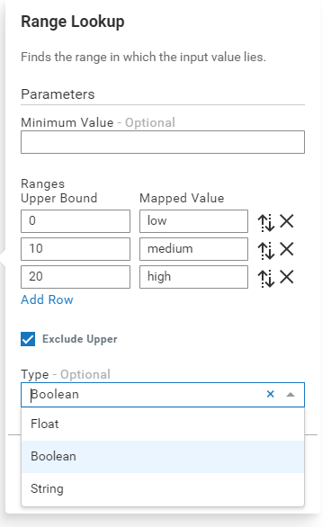

# Parameters, block startup and error handling

Blocks may specify a number of parameters that can be provided to customize the behavior of the block. Block parameters are shown in the model editor, and are provided to the block when the model starts.

Block parameters can be one of the following types:

* `string`
* `float`
* enumerations of any of the above types (that is, multiple valid values)
* `boolean`
* `sequence<NameValue>` where `NameValue` has `string name` and `any value` fields
* `optional<>` of any of the above types

The **Range Lookup** block shows examples of these types:



* **Minimum Value** is an `optional<float>` input (text box, similar to `string` parameters).
* **Ranges** is a `sequence<NameValue>` with three values for "0:low", "10:medium" and "20:high".
* **Exclude Upper** is a `boolean`.
* **Type** is an enumeration of `string` for type names ("Boolean" is currently selected).

Block parameters are represented by a separate event definition, named after the block with a `_$Parameters` suffix, with a field for each parameter, and this is provided as a field of the block named `$parameters`:

```Java
event Offset_$Parameters {
    float offset;
}

event Offset {
    Offset_$Parameters $parameters;
...
}
```

When a model is started, values for the block parameters will be filled in (if a block parameter is an `optional<>`, then it may be left as an empty optional). If a model has multiple instances of the same block, each block will have separate parameter values.

The block should not typically modify the block parameters. If the block wishes to generate derived values of the parameters, then add these as fields on the block (without `$` prefixes).

## Default parameters

A default value for a parameter can be supplied by including a `constant` member of the `$Parameters` event type, named `$DEFAULT_<parameter id>`. For example:

```Java
event Offset_$Parameters {
    float offset;
    constant float $DEFAULT_offset := 0.0;
}
```

Default values are values provided in the model editor when a block is first added to a model. The user thus does not have to explicitly set a value for a parameter with a default value.

## Parameter enumerations

A parameter can be defined as one of a number of available options. In the model editor, this is shown as a drop-down list. For an example, see the **Type** parameter in the **Range Lookup** block shown above. The different options for an enumeration are defined as constant field members, using a `constant` named `<parameter id>_<enumeration option id>` where `enumeration option id` is just a unique identifier for that option. For example:

```Java
    /***
     * Type
     *
     * The type that is to be used for the output value.
     */
    optional<string> type;

    /** Float */
    constant string type_float := "float";

    /** Boolean */
    constant string type_boolean := "boolean";

    /** String */
    constant string type_string := "string";
```

Note that the ApamaDoc on each option gives the name for the option that is used in the model editor.

## Validating parameters

The block may wish to perform some checking of the block's parameters; not all values or combinations of values are necessarily valid. The block can do this by implementing a `$validate` action on either the `$Parameters` type or the block itself. The `$validate` method should check the values of the `$Parameters` and throw an exception if the parameters are invalid. (A `$validate` method on the block may also check things such as which inputs are connected, or what type they are). The `BlockBase` type includes a `throwsOnEmpty` method that will throw if a string value is empty, as this is a common validation.

Blocks do not have to check that all required parameters are present or of the correct type. If a parameter is of a concrete type and not optional, it must be present and of the correct type. The framework will report an error before calling `$validate` for the block.

When throwing an exception, it is recommended to provide the message of the exception as a message property, which is stored in a separate JSON file, which maps message identifiers to the text of the message. The message identifier should be `block_msg_<type of the block>_<identifier>`. When using a message property, it is possible to provide values to be substituted into the message - use `{{0}}` (and higher numbers) in the message text. Use the `L10N.getLocalizedException` action to obtain an exception to throw. For example, to provide a message indicating a value is out of range and which includes the value provided, use a `$validate` method:

```Java
action $validate() {
    if offset < 0.0 or not offset.isFinite() {
        throw L10N.getLocalizedException(
            "block_msg_apamax.sampleblock.Offset_outOfRange", [<any> offset]);
    }
}
```

And provide a message in a JSON file named **messages.json** as follows:

```JSON
{
    "block_msg_apamax.sampleblock.Offset_outOfRange": "Value {{0}} is out of range (must be zero or a positive finite number)"
}
```

While the block SDK currently only supports English messages, this mechanism will be used in future releases to provide support for translating error messages to other languages.

Refer to the **TimeDelay.mon** sample for an example of a block that uses a parameter value and validates it.

## Initialization actions

After the model has validated all blocks (calling `$validate` methods where present, and checking that the supplied parameters match the required parameters for all blocks, and other checks), then the model is ready for execution. After validation, but before the first values are processed in the model, the model will call any `$preSpawnInit` and `$init` actions on blocks. The `$preSpawnInit` action will only be called once, while `$init` may be called on each worker thread. These methods should never throw an exception. If any checks are required that may fail, they should occur in the `$validate` method. The `$init` method would be where blocks that receive external input set up listeners, and if the block wishes to notify another system that it has started, then that should happen in the `$preSpawnInit` case.

The `$validate`, `$preSpawnInit` and `$init` methods do not have any required parameters, but they may optionally take:

* `dictionary<string,any> $modelScopeProperties` - contains the model name, mode and mode properties. (See the `ABConstants` type for the key values to use.)
* `ConfigurationProperty $configPropertyValues` - accessor for global configuration properties.

These should be treated as read-only.

[< Prev: Testing blocks](035-Testing.md) | [Contents](000-contents.md) | [Next: Blocks with state >](050-State.md) 
